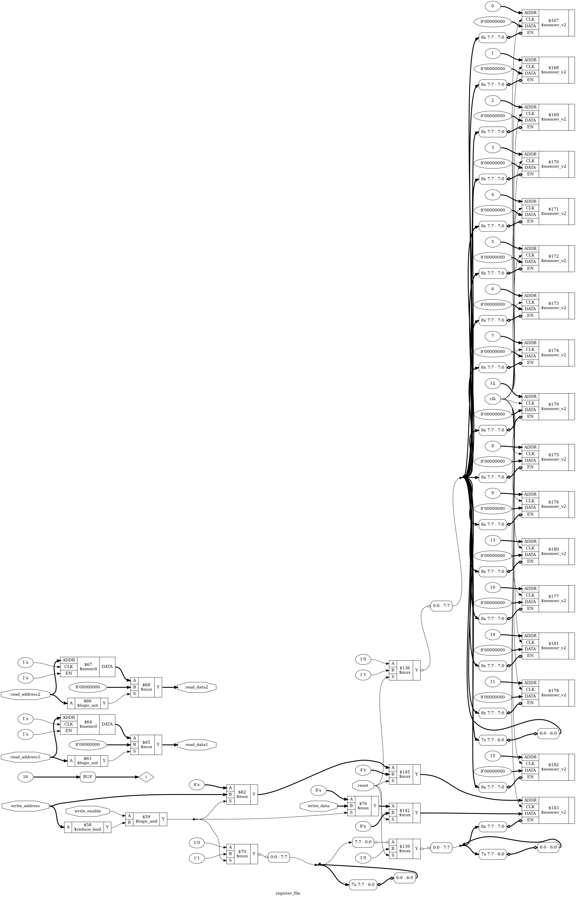

# Summer Internship Project: Parameterized Multi-Port Register File

## Overview
This repository contains the RTL design and comprehensive verification environment for a **Parameterized Multi-Port Register File (1W/2R)**. The architecture supports high-speed central storage layers typical in RISC-V pipeline processor execution cores.

## Design Parameters
* **`DATA_WIDTH`:** 8-bit (Register word size)
* **`NUM_REGISTERS`:** 16 (Depth of the storage bank)
* **`ADDR_WIDTH`:** 4-bit (Binary decode limit)

## RTL Schematic Diagram

## Toolchain Used
* **Simulation:** Icarus Verilog (`iverilog`) + VVP
* **Waveform Viewer:** GTKWave
* **Synthesis Suite:** Yosys Open SYNT
